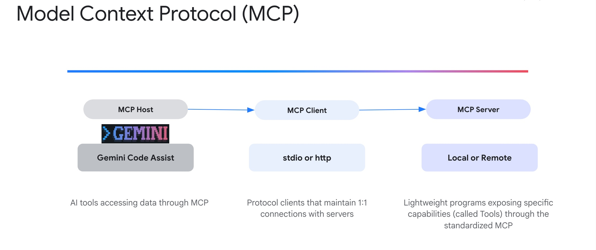

# Configuring Model Context Protocol (MCP) Servers

## What is MCP ?

MCP is an open standard that solves a fundamental challenge in AI system integration: the fragmentation problem. 
Without MCP, every AI application needs custom integrations with every tool it wants to access. MCP replaces this chaos with a single, standardized protocol built on JSON-RPC 2.0. 


An MCP server is an application that exposes tools and resources to the Gemini CLI through the Model Context Protocol, allowing it to interact with external systems and data sources. MCP servers act as a bridge between the Gemini model and your local environment or other services like APIs.




An MCP server enables the Gemini CLI to discover and execute tools thereby extending Gemini CLI's capabilities to perform actions beyond its built-in features, such as interacting with databases, APIs, custom scripts, or specialized workflows.

Gemini CLI supports configuring MCP Servers for discovering and using custom tools. If you have Gemini CLI launched, you can check up on the MCP servers configured via the `/mcp` command.

## Gemini CLI MCP config

If you have not configured any MCP servers, it will launch Gemini CLI's MCP Server documentation.

You can configure MCP servers at the global level in the `~/.gemini/settings.json` file or in your project's root directory. Create or open the `.gemini/settings.json` file. Within the file, you will need to add the `mcpServers` configuration block, as shown below:

```json
"mcpServers": {
  "server_name_1": {},
  "server_name_2": {},
  "server_name_n": {}
}
```

Each server configuration supports the following properties ([Reference documentation](https://github.com/google-gemini/gemini-cli/blob/main/docs/mcp-servers.md#server-configuration)):

**Required (one of the following)**

*   `command` (string): Path to the executable for Stdio transport
*   `url` (string): SSE endpoint URL (e.g., "http://localhost:8080/sse")
*   `httpUrl` (string): HTTP streaming endpoint URL

**Optional**

*   `args` (string[]): Command-line arguments for Stdio transport
*   `headers` (object): Custom HTTP headers when using `url` or `httpUrl`
*   `env` (object): Environment variables for the server process. Values can reference environment variables using `$VAR_NAME` or `${VAR_NAME}` syntax
*   `cwd` (string): Working directory for Stdio transport
*   `timeout` (number): Request timeout in milliseconds (default: 600,000ms = 10 minutes)
*   `trust` (boolean): When `true`, bypasses all tool call confirmations for this server (default: `false`)
*   `includeTools` (string[]): List of tool names to include from this MCP server. When specified, only the tools listed here will be available from this server (whitelist behavior). If not specified, all tools from the server are enabled by default.
*   `excludeTools` (string[]): List of tool names to exclude from this MCP server. Tools listed here will not be available to the model, even if they are exposed by the server.
    *Note: `excludeTools` takes precedence over `includeTools` - if a tool is in both lists, it will be excluded.*

Let us go ahead and configure one of the key MCP servers that you might need if you are working with JIRA. You would probably have a question: if you already have JIRA and other related tools set up on your system, would you still need the JIRA MCP Server?

Gemini CLI will invoke the git tools that you have on your system and you may also instruct the Gemini CLI to use that. So do keep in mind that Gemini CLI will help in translating your natural language queries to equivalent tools that you may have on your system and it may require that you explicitly state that in your prompt.

## Task 1 Configure JIRA MCP Server

The [JIRA official MCP Server](https://support.atlassian.com/atlassian-rovo-mcp-server/docs/setting-up-ides/) provides sufficient documentation on the tools that it exposes along with how to configure the same. You can pick your choice in terms of running it locally or remotely, since Gemini CLI supports remote MCP Servers too.

This Lab demonstrates the Remote MCP Server option in JIRA. 

Once you have that, you will need to add the MCP Server object in the `settings.json` file. The complete `settings.json` file on my system is shown below. You might have additional settings, but the `mcpServers` object should be as given below:

```
cd ~/gemini-cli-projects
mkdir .gemini
cd .gemini
```

Paste the `settings.json` in you project level `gemini` folder
 
```json
cat <<EOF > settings.json
{
  "theme": "Default",
  "ideMode": true,
  "selectedAuthType": "oauth-personal",
  "mcpServers": {
       "atlassian": {
           "command": "npx",
           "args": [
               "-y",
               "mcp-remote",
               "https://mcp.atlassian.com/v1/sse"
           ]
       }
  }
}
EOF
```


You can either start Gemini CLI again or do a `/mcp refresh` command, once you have updated the `settings.json` with the Github MCP Server configuration.

```
/mcp refresh
```

Now you will need to Authenticate to JIRA


List configured JIRA MCP server:

```
/mcp list
```

!!! Discuss
    Review what tools JIRA MCP server has (e.g create issue, fetch issue, Add comments to JIRA)


Now you can interact with JIRA from you CLI!

```
- "Create a new issue SCRUM-2 in the boutique project titled 'UI update' and describe it as 'Implement the new feature as for UI .'"
- "List all the issues in the boutique project."
- "Add a comment to SCRUM-2 saying 'This is a comment'"
- "Show me the details for issue SCRUM-2."
- "Assign issue SCRUM-2 to Archy k."
- "Move SCRUM-2 to 'In Progress'."
```

## More MCP Servers

Here is an additional list of MCP servers that you might be interested in:

*   Firebase MCP Server
*   Google Gen AI Media Services (Imagen, Veo, Lyria)
*   MCP Toolbox for Databases (work with Firestore, BigQuery, Google Cloud databases)
*   Google Workspace MCP Server (work with Docs, Sheets, Calendar, Gmail)

The instructions for setting up the above MCP servers are published in [this blog post](https://medium.com/google-cloud/supercharge-gemini-cli-with-custom-tools-and-mcp-servers-b599a35a379c).


## JIRA Prompts Cheatsheet

Once the JIRA MCP Server is configured, you can interact with JIRA using natural language prompts. Here are some examples of what you can ask Gemini CLI to do:

### General
- "Show me what I can do with JIRA"
- "How do I work with issues in JIRA?"
- "Tell me about JIRA projects"

### Issue Management
- "Create a new issue SCRUM-2 in the boutique project titled 'UI update' and describe it as 'Implement the new feature as for UI .'"
- "List all the issues in the boutique project."
- "Add a comment to SCRUM-2 saying 'This is a comment'"
- "Show me the details for issue SCRUM-2."
- "Assign issue SCRUM-2 to Archy k."
- "Move SCRUM-2 to 'In Progress'."

### Advanced Workflows
- "Create a sub-task for boutique-123 with the title 'Sub-task for feature'."
- "Find all 'In Progress' issues in the boutique project, ordered by creation date."
- "Log 2 hours and 30 minutes of work on issue boutique-123."
- "Link issue boutique-123 as 'blocks' issue boutique-456."

### Sprint Manaboutiqueent
- "Create a new sprint named 'New Sprint' on board 1."
- "Add issue boutique-123 to the current sprint."
- "Start sprint 42 and set its duration to two weeks."
- "Show me all the issues in the active sprint."
