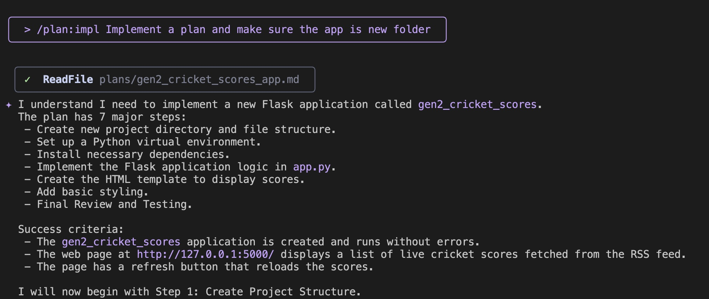

# 🛠️ Custom / Commands

## Why custom / slash commands?

If you noticed your usage of Gemini CLI so far, you would have noticed that either we were just giving the prompt and expecting Gemini CLI to execute it, sometimes with results that are not as per our expectations. In some prompts, you were a bit specific in terms of what to do and have included those instructions in the prompt.

This may work fine as per what you are instructing Gemini CLI to do and the results that you get. But in many cases, you want to ensure that it follows rules. These rules could be specific programming languages or frameworks to use. It could also be specific tools. It could be coding styles. It's not just about generation but you might also want Gemini CLI to strictly be in what is called a "planning" mode and would like it to just present a plan and not generate any code or modify files on the system.

Enter `Custom slash commands` in Gemini CLI which allow you to save and reuse your most frequently used prompts as personal shortcuts. You can create commands that are specific to a single project or available globally across all your projects.

## How / slash commands work?

Custom commands allow you to create powerful, reusable prompts. They are defined in TOML files and stored in a `commands` directory.

-   **Global commands:** `~/.gemini/commands/`
-   **Project-specific commands:** `<project>/.gemini/commands/`

To create a custom command, you need to create a `.toml` file in one of these directories.

For example, to create a `/plan` command, you would create a `plan.toml` file. Each TOML file must have a `description` and a `prompt`.

Here is an example of a `plan.toml` file:

```toml
description="Investigates and creates a strategic plan to accomplish a task."

prompt = """
Your primary role is that of a strategist, not an implementer.
Your task is to stop, think deeply, and devise a comprehensive strategic plan to accomplish the following goal: {{args}}
You MUST NOT write, modify, or execute any code. Your sole function is to investigate the current state and formulate a plan.
Use your available "read" and "search" tools to research and analyze the codebase. Gather all necessary context before presenting your strategy.
Present your strategic plan in markdown. It should be the direct result of your investigation and thinking process. Structure your response with the following sections:

1. **Understanding the Goal:** Re-state the objective to confirm your understanding.
2. **Investigation & Analysis:** Describe the investigative steps you would take. What files would you need to read? What would you search for? What critical questions need to be answered before any work begins?
3. **Proposed Strategic Approach:** Outline the high-level strategy. Break the approach down into logical phases and describe the work that should happen in each.
4. **Verification Strategy:** Explain how the success of this plan would be measured. What should be tested to ensure the goal is met without introducing regressions?
5. **Anticipated Challenges & Considerations:** Based on your analysis, what potential risks, dependencies, or trade-offs do you foresee?

Your final output should be ONLY this strategic plan.
"""
```
!!! note
    The `{{args}}` placeholder in the prompt will be replaced with any text the user types after the command name.
    After creating the `.toml` file and restarting Gemini CLI, the new slash command will be available.

## Task 1 Configure /plan custom command

We've prepared set of custom / commands for you usage [here:](https://github.com/cloud-native-canada/gem_cli_custom_commands/tree/main/commands)

Review the github repo and explore how `.toml` files are looking like. Below is the summary table how to use those commands.

| Command | Description |
| :--- | :--- |
| explain | Explain mode. Analyzes the codebase to answer questions and provide insights |
| explain:interactive | Interactive Explore mode. Interactively explains the codebase through guided discovery.
|  |  
| plan:new | Plan mode. Generates a plan for a feature based on a description
| plan:refine | Refinement mode. Refines an existing plan based on user feedback.
| plan:impl | Implementation mode. Implements a plan for a feature based on a description
|  |  
| deploy:project | Deploys the project to a target environment


**Step 1:** Install Custom Commands on Laptop

You can install these configurations globally for all projects or locally for a single project.

!!! important 
    Choose only one of the methods below. Global or Project-Specific

**Global Installation:**

Copy the `commands` folder from the [repo](https://github.com/GoogleCloudPlatform/serverless-production-readiness-java-gcp/tree/main/genai/gemini-cli-extensions/commands) to the root folder of your machine under `~/.gemini/commands/`

```bash
git clone --depth 1 https://github.com/GoogleCloudPlatform/serverless-production-readiness-java-gcp.git ~/.gemini-tmp && 
rsync -av ~/.gemini-tmp/genai/gemini-cli-extensions/commands/ ~/.gemini/commands && rm -rf ~/.gemini-tmp
```

**Project-Specific Installation:**

Copy the `commands` folder from the [repo](https://github.com/GoogleCloudPlatform/serverless-production-readiness-java-gcp/tree/main/genai/gemini-cli-extensions/commands) to the `.gemini/commands/` folder of your project.

```bash
git clone --depth 1 https://github.com/GoogleCloudPlatform/serverless-production-readiness-java-gcp.git .gemini-tmp && 
rsync -av .gemini-tmp/genai/gemini-cli-extensions/commands/ ./.gemini/commands && rm -rf .gemini-tmp
```

**Step 2:** Check if new commands has been installed

```
/help
```

**Output:**
```
Commands:                                                                                                                                                │
│  /about - show version info
....                                                        
│  /explain - Explain mode. Analyzes the codebase to answer questions and provide insights.                                                                │
│  /plan:refine - Refinement mode. Refines an existing plan based on user feedback.                                                                        │
│  /plan:new - Plan mode. Generates a plan for a feature based on a description                                                                            │
│  /plan:impl - Implementation mode. Implements a plan for a feature based on a description                                                                │
│  /generate:gemini_md - Analyzes the current project directory recursively and generate a comprehensive GEMINI.md file                                    │
│  /explain:interactive - Interactive Explore mode. Interactively explains the codebase through guided discovery.                                          │
│  /deploy:project - Deploys the project to a target environment.                                                                                          │
│  ! - shell command                                           
```

!!! result 
    New Custom /plan, /explain, and /deploy commands has been installed


## Task 2 Create /plan and implement plan for new application

**Step 1** Prompt to plan a new app

```bash
/plan:new I would like to create a Python Flask Application that shows me a list of live scores of cricket matches. 
There is a RSS Feed for this that is available over here: `https://static.cricinfo.com/rss/livescores.xml`.  
```

!!! Alternatively
    You can create a JIRA task with above information and use JIRA MCP integration to fetch a task description

**Step 2** Review a generated plan


** Result**: Generated plan stored in `plans` forlder  in `md` format.

!!! important
    Review and modify plan until it is required

**Step 3** Implement code for new app according to plan and deploy it

```bash
/plan:impl I would like to implement a plan and make sure the app created in a new folder 
```



!!! Result
    The cricket scores app is created and has been launched for local testing.


!!! note
    The app looks more advanced then we created one during vibecoding test.


## Task 3 Create a plan and implement new features in your existing codebase.

!!! Congratulations
    It is now time to put things in practice.
    Will let you work with you day to day applications using JIRA MCP and Custom / commands to build you apps!


## Conclusion: Your Workflow, Your Rules

In this Lab, we have learnt about Custom Commands in Gemini CLI, which are simple shortcuts, organized into namespaces and which can run powerful and personalized tasks for us.