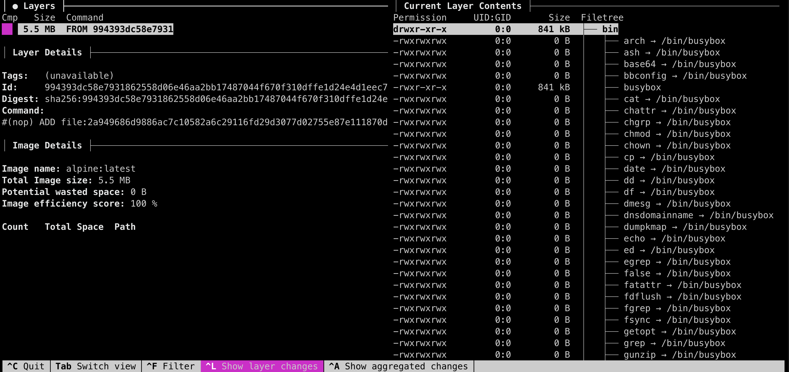

# Other cool apps for Kubernetes

Here is a list of some more apps that a cool to have.

## KubePug / Deprecations

[KubePug](https://github.com/rikatz/kubepug)/Deprecations is intended to be a kubectl plugin, which:

- Downloads a swagger.json from a specific Kubernetes version
- Parses this Json finding deprecation notices
- Verifies the current kubernetes cluster or input files checking whether exists objects in this deprecated API Versions, allowing the user to check before migrating

This is a tool that you can use locally or in your CI to ensure you're not working with deprecated resources.

### install

```bash
kubectl krew install deprecations
```

### Usage

- Full cluster scan

    This will walk you through all your k8s resources (in the local context) and compare them to the target version (here 1.25). You will get warnings if you still have resources using deprecated APIs :

    ```bash
    kubectl deprecations --k8s-version v1.25.0
    ```

- File scan

    This command will look at the resources inside the `../yaml/sample_app.yaml` and compare it to the Kubernetes API version `v1.25.0`. It will report every resource that is outdated:

    ```bash
    kubectl deprecations --k8s-version v1.25.0 --input-file ../yaml/sample_app.yaml
    ```

## Dive

[Dive](https://github.com/wagoodman/dive) is an utility to inspect Docker Images. While it is not directly used with Kubernetes, it can help improve size and security in the pod's images.

### Install

```bash
brew install dive
```

!!! note

    If using `podman` or any Docker-For-desktop replacement, you need to ensure `Dive` will be able to connect to the Docker Daemon. Set `DOCKER_HOST` variable accordinately:

    ```bash
    export DOCKER_HOST="unix://$HOME/.local/share/containers/podman/machine/podman-machine-default/podman.sock"
    ```

### Usage

- check Alpine image

    ```bash
    dive alpine:latest
    ```

    

## Dasel

Use [Dasel](https://github.com/TomWright/dasel) to query and modify data structures using selector strings.

It is Comparable to [jq](https://github.com/stedolan/jq) / [yq](https://github.com/kislyuk/yq), but supports JSON, YAML, TOML, XML and CSV with zero runtime dependencies.

This is the swiss army knife of the structrued file (in the command line).

## Install

=== "Apple MacOS X"

    ```bash
    brew install dasel
    ```

=== "Go"

    ```bash
    go install github.com/tomwright/dasel/cmd/dasel@master
    ```


## Usage

Here's some sample usage, taken from the doc:

```bash
# Pretty Print JSON
echo '[{"name": "Tom"},{"name": "Paul"}]' | dasel -p json
[
  {
	"name": "Tom"
  },
  {
	"name": "Paul"
  }
]

# JSON to YAML
echo '[{"name": "Tom"},{"name": "Paul"}]' | dasel -r json -w yaml
- name: Tom
- name: Paul

```

While this is some good example, here's some real-case usage with K8s.

Let's create a sample deployment file:

```bash linenums="1"
cat > deployment.yaml << EOF
apiVersion: apps/v1
kind: Deployment
metadata:
  name: example-app
  namespace: test
spec:
  progressDeadlineSeconds: 600
  replicas: 1
  revisionHistoryLimit: 10
  selector:
    matchLabels:
    app: example-app
  template:
    metadata:
  	  creationTimestamp: null
  	  labels:
        app: example-app
    spec:
      containers:
      - image: alpine:latest
        imagePullPolicy: Always
        name: manager
        ports:
        - containerPort: 8080
          name: web
          protocol: TCP
EOF
```

!!! warning

    It is important to keep the `.yaml` extension of the file as `Dasel` use it to auto-find the right language. If not, you can force it using the `-p` or `--parser` flag, or the individual `--read` and `--write`.

- Select the image of the `manager` container
  
    ```yaml
    dasel -p yaml select -f deployment.yaml -s "spec.template.spec.containers.(name=manager).image"
    ```
    ```bash
    alpine
    ```

- Change the image of the `manager` containe in-place

    ```bash
    dasel put string -f deployment.yaml -s "spec.template.spec.containers.(name=manager).image" "ubuntu:latest"
    ```

- Update replicas to 3 in-place
  
    ```bash
    dasel put int -f deployment.yaml -s "spec.replicas" 3
    ```

- Add a new env var to the deployment

    ```bash
    dasel put object -f deployment.yaml -s "spec.template.spec.containers.(name=manager).env.[]" -t string -t string name=MY_NEW_ENV_VAR value=MY_NEW_VALUE
    ```

- Update an existing env var

    ```bash
    dasel put string -f deployment.yaml -s "spec.template.spec.containers.(name=manager).env.(name=MY_NEW_ENV_VAR).value" NEW_VALUE
    ```

!!! warning

    The above commands are not fail-proof, and executing `dasel put` multiple times may generate invalid yaml.

## Next

This is the end of the tutorial. If you want, use [the Cleanup script](../cleanup/cleanup.md) to remove most of what you installed.