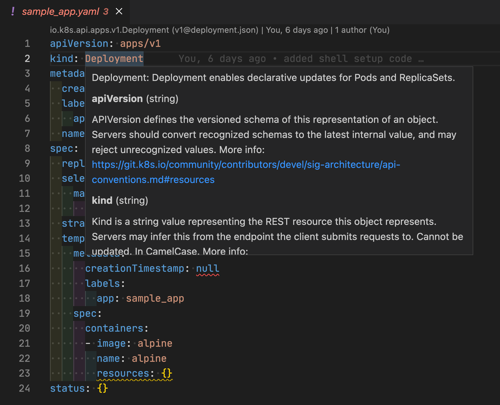

# VsCode Extensions

VSCode is widely used as an editor and there’s a few, well, there’s a ton of extensions that can enhence the productivity. Here are a few.

## Kubernetes extension

The [Kubernetes extension](https://marketplace.visualstudio.com/items?itemName=ms-kubernetes-tools.vscode-kubernetes-tools) brings with it all the highlighting, linting and documenting of k8s resources, plus a lot of commands to work with Docker, K8s, Helm… it’s actually far too much to use it all.

## YAML extension

The [YAML extension](https://marketplace.visualstudio.com/items?itemName=redhat.vscode-yaml) is, well, just about yaml. This one is mandatory and it's usually already installed ! 

## Indent-Rainbow extensions

One of the biggest problems with YAML is indentation… you miss one, yaml is not valid. 

When you have 1000+ lines of yaml, go find the error… and this is less uncommon than you may think.

[Indent-Rainbow extension](https://github.com/oderwat/vscode-indent-rainbow) color-code the tabs in your YAMLs so it’s visually easy to see how many tabs you have in your file.

This is totally a productivity tool that every developper needs.

(Thank you [@melmaliacone](https://github.com/melmaliacone) for sharing this)

