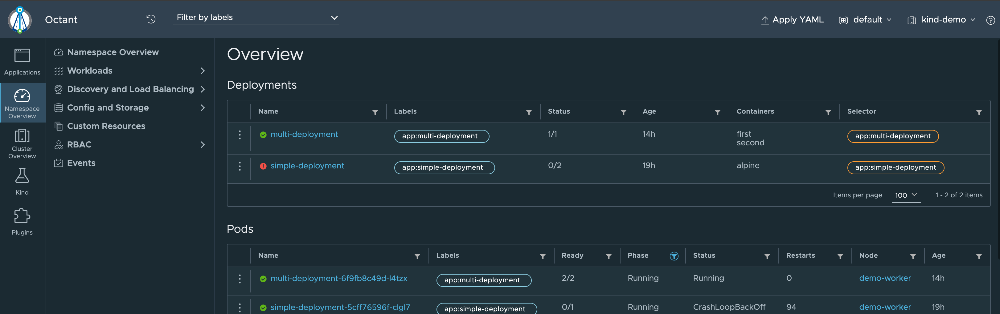

# Octant

[Octant](https://github.com/vmware-tanzu/octant) is a tool for developers to understand how applications run on a Kubernetes cluster. It aims to be part of the developer's toolkit for gaining insight and approaching complexity found in Kubernetes. Octant offers a combination of introspective tooling, cluster navigation, and object management along with a plugin system to further extend its capabilities.

Octant is a Go "backend" application that run on your laptop and use a browser to access the service. It use your local Kube Config to discover clusters.

## Install

=== "Mac Os X"

    ```bash
    brew install octant
    mkdir -p  ~/.config/octant/plugins

    octant
    ```

=== "Linux"

    Download the .deb or .rpm from the [releases page](https://github.com/vmware-tanzu/octant/releases).

=== "Windows"

    ```bash
    choco install octant --confirm
    ```

    Or download a pre-built package from the [releases page](https://github.com/vmware-tanzu/octant/releases).

## Usage

Octant will open a brower and connect to the Octant App when you start it. 

You can then browse your clusters and edit the resources.

You can install plugins, which are Go binaries.



## Next

Need a mobile phone app ? check [next chapter](kubenav.md) !