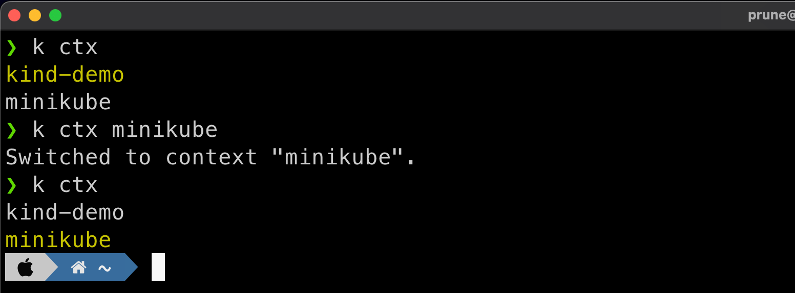

# Extending `kubectl`

`kubectl` has now two ways to be extended: `plugins` and `krew`

`Krew` is a tool that makes it easy to use `kubectl` plugins. It's the first tooling that was avaiable and is still widely used.

`Plugins` is the newer way and is simple: create a command in your path with the name `kubectl-<whatever>` and call `kubectl <whatever>` from your shell. `kubectl` will execute your command.

## Creating and using Plugins

Create a script in `/usr/local/bin/kubectl-foo`:

```bash title="/usr/local/bin/kubectl-foo"
cat > /usr/local/bin/kubectl-foo << EOF
#!/bin/bash
echo foo
EOF
```

Make it executable and call it through `kubectl`:

```bash
chmod 755 /usr/local/bin/kubectl-foo
kubectl foo
```
```bash title="output"
foo
```

It's really easy to list plugins:

```bash
kubectl plugin list
```
```bash  title="output" hl_lines="5 5"
The following compatible plugins are available:

/usr/local/bin/kubectl-1.20.0
/usr/local/bin/kubectl-krew
/usr/local/bin/kubectl-foo
/usr/local/bin/kubectl-v1.21.13
```


## Krew

`Krew` is an example of such a kubectl plugin that act as a plugin manager for kubectl. It pre-dates the plugin addition in kubectl and may seem useless now, but it still has it's role to play.

### Install

Please refer to the [official install doc](https://krew.sigs.k8s.io/docs/user-guide/setup/install/).

=== "Apple Mac"

    ```bash title="krew install"
    brew install krew
    ```

=== "Using Krew"

    This one is using `krew` itself to install `krew`.

    !!! note

        `krew` installs plugins in `$KREW_ROOT` if you set it or `$HOME/.krew`. You have to then ensure `$HOME/.krew` is in your path.

        Add this to your `.zshrc` or `.bashrc`:

        ```bash
        export PATH="${KREW_ROOT:-$HOME/.krew}/bin:$PATH"
        ```

    ```bash
    (
      set -x; cd "$(mktemp -d)" &&
      OS="$(uname | tr '[:upper:]' '[:lower:]')" &&
      ARCH="$(uname -m | sed -e 's/x86_64/amd64/' -e 's/\(arm\)\(64\)\?.*/\1\2/' -e 's/aarch64$/arm64/')" &&
      KREW="krew-${OS}_${ARCH}" &&
      curl -fsSLO "https://github.com/kubernetes-sigs/krew/releases/latest/download/${KREW}.tar.gz" &&
      tar zxvf "${KREW}.tar.gz" &&
      ./"${KREW}" install krew
    )
    ```

=== "Windows"

    - Make sure git is installed.
    - Download `krew.exe` from the [Releases](https://github.com/kubernetes-sigs/krew/releases) page to a directory.
    - Launch a command prompt (`cmd.exe`) with administrator privileges (since the installation requires use of symbolic links) and navigate to that directory.
    - Run the following command to install krew:
        ```bash
        .\krew install krew
        ```
    - Add the `%USERPROFILE%\.krew\bin` directory to your `PATH` environment variable (how?)
    - Launch a new command-line window.
    - Run `kubectl krew` to check the installation.
    
### Usage

```bash
kubectl krew list
```
```bash title="output"
PLUGIN  VERSION
ctx     v0.9.4
krew    v0.4.1
ns      v0.9.4
whoami  v0.0.36
```
```bash
kubectl krew search
```
```bash title="output"
NAME                            DESCRIPTION                                         INSTALLED
access-matrix                   Show an RBAC access matrix for server resources     no
blame                           Show who edited resource fields.                    no
cert-manager                    Manage cert-manager resources inside your cluster   no
ctx                             Switch between contexts in your kubeconfig          yes
...
```

### Krew must-have Plugins

Here are some of the cool Plugins to have:

- ctx: current cluster `Context` and quick context changes
- ns: current `Namespace` and quick namespace changes
- [whoami](https://github.com/rajatjindal/kubectl-whoami): who the cluster thinks you are from your authentication
- [who-can](https://github.com/aquasecurity/kubectl-who-can): RBAC rules introspection

Install them with this command:

```bash
kubectl krew install ctx ns stern whoami who-can
```

## manage Kubernetes `context`

`kubectl` is using the notion of `contexts` to define which cluster you know and which one is actuvelly being used. 

All this is defined in the `$HOME/.kube/config` file. This file can get quite large and difficult to work with.

`kubectl` has a default command to change context:

```bash
kubectl config get-contexts
```
```bash title="output"
CURRENT   NAME        CLUSTER     AUTHINFO    NAMESPACE
*         kind-demo   kind-demo   kind-demo
          minikube    minikube    minikube    default

# use your GKE cluster minikube
kubectl config use-context minikube
```

While this is not that bad, we can do even better with `ctx`. Also, when using `kubecolor`, the current context is highlighted:

```bash
# list all the existing context, current one is in yellow
k ctx
```
```bash  title="output" hl_lines="1 1"
kind-demo
minikube
```

You can also change context quickly by just appending the name of the target context to the same command:

```bash
# change the context to minikube using ctx
k ctx minikube
```
```bash title="output" hl_lines="2 2"
kind-demo
minikube
```

Finaly you can delete a context (but don't do it right now):

```bash
# remove the minikube context
k ctx -d minikube
```



## manage Kubernetes `namespaces`

Almost the same thing as `ctx`, the `ns` command will switch your default `namespace`:

```bash
# show namespaces
k ns
```
```bash title="output" hl_lines="1 1"
default
kube-node-lease
kube-public
kube-system
```

Switch to `kube-system` namespace:

```bash
k ns kube-system
k ns
```
```bash title="output" hl_lines="7 7"
Context "minikube" modified.
Active namespace is "kube-system".

default
kube-node-lease
kube-public
kube-system
```


