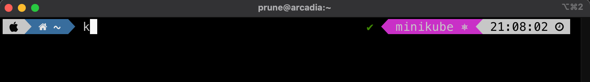
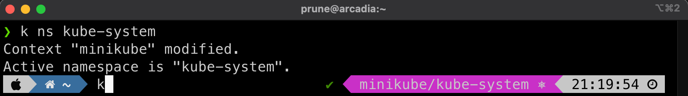

# Kubie

[Kubie](https://github.com/sbstp/kubie) offers context switching, namespace switching and prompt modification in a way that makes each shell independent from others.

This is an alternative to `k ctx` and `k ns` in a way where instead os switching your `context` back and forth and use the same `context` in all your `terminals` (all your `shells`), you pin one `context` per `terminal`.

Under the hood, it automates the use of the `KUBECONFIG` env variable to allow each shell to be configured differently.

!!! note
    The `KUBECONFIG` variable, if set, will tell `kubectl` to use a specific `config` file instead of the default `~/.kube/config` file.

!!! warning
    It can be dangerous to use `kubie` as you may just enter a command in the wrong shell. It requires a little bit more of attention. Same thing as running `rm -rf *` and using `ssh` toward a production server.

    It is easier to control when all your shells targets only one cluster and you need to use the –context parameter to switch.
    
    At least, if you use Kubie, ensure your shell’s prompt is clearly displaying the cluster/namespace you’re in !

Then, it works almost the same as `ctx`/`ns`, except the selection is only for the current shell.

The cool feature is that you can execute a command in some (or all) of the contexts base on a regexp… it can be handy sometimes

## Install

=== "Apple MacOsX"

    ```bash
    brew install kubie
    ```

=== "Linux"

    You can download a binary for Linux or OS X on the [GitHub releases page](https://github.com/sbstp/kubie/releases).
    
    Use `curl` or `wget` to download it. Don't forget to `chmod +x` the file:

    ```bash
    wget https://github.com/sbstp/kubie/releases/download/v0.19.0/kubie-linux-amd64
    chmod 755 kubie-linux-amd64
    sudo mv kubie-linux-amd64 /usr/local/bin/kubie
    ```

=== "Windows"

    TODO

## Usage

- display a selectable menu of contexts
    ```bash 
    kubie ctx
    ```

- display a selectable menu of namespaces
    ```bash
    kubie ns
    ```

- execute a command in all contexts matched by the wildcard and in the given namespace
    ```bash
    kubie exec <wildcard> <namespace> <cmd> <args>
    ```

## Multi-Context Demo

Before we start using `kubie`, we have two contexts, one for the `kind-demo` and one for the `minikube` cluster. Let's switch to the `kind-demo` context:

```bash
k ctx kind-demo
k ctx
```
```bash title="output" hl_lines="1 1"
kind-demo
minikube
```

Open a second shell/terminal, and run the same command but switch to the `minikube` context:

```bash
k ctx minikube
k ctx
```
```bash title="output" hl_lines="2 2"
kind-demo
minikube
```

Go back in the previous shell, and check which context you're in:

```bash
k ctx
```
```bash title="output" hl_lines="2 2"
kind-demo
minikube
```

The default context is still set to `minikube`. This is because at this moment the `context` is global and set in the `~/.kube.config` file. We can check that using grep:

```bash
cat  ~/.kube/config | grep current-context
```
```bash title="output"
current-context: minikube
```

In the first shell, use `kubie` to switch to the `minikube` context:

```bash
kubie ctx minikube

k ctx
```
```bash title="output"
minikube
```

Now only one `context` is displayed. This is because `kubie` re-configured your context and statically pinned one cluster.

Under the hood, `kubie` used the `KUBECONFIG` env variable and set it to use a new config file:

```bash
env | grep KUBE
```
```bash title="output"
KUBECONFIG=/var/folders/mt/b1zldbxs4wnf78m2p0mv444h0000gn/T/kubie-configMawRW2.yaml
KUBIE_KUBECONFIG=/var/folders/mt/b1zldbxs4wnf78m2p0mv444h0000gn/T/kubie-configMawRW2.yaml
```
If we look into this file, it's a new file similar to the `~/.kube/config` file but with only one cluster in it:

```yaml
---
clusters:
  - name: minikube
    cluster:
      certificate-authority: /Users/prune/.minikube/ca.crt
      extensions:
        - extension:
            last-update: "Thu, 20 Oct 2022 18:17:15 EDT"
            provider: minikube.sigs.k8s.io
            version: v1.27.1
          name: cluster_info
      server: "https://192.168.64.2:8443"
users:
  - name: minikube
    user:
      client-certificate: /Users/prune/.minikube/profiles/minikube/client.crt
      client-key: /Users/prune/.minikube/profiles/minikube/client.key
contexts:
  - name: minikube
    context:
      cluster: minikube
      namespace: ~
      user: minikube
current-context: minikube
apiVersion: v1
kind: Config
```

In the second shell/terminal, use `kubie` to switch to the `kind-demo` context:

```bash
kubie ctx kind-demo

k ctx
```
```bash title="output"
kind-demo
```

This shell is in the `kind-demo` context. Go back to the first shell and check:

```bash
k ctx
```
```bash title="output"
minikube
```

## I don't know which context i'm using

Having two different context in two co-located shells is really dangerous. It's better to identify which cluster is selected before typing a `kubectl` command which could change some resources.

To solve this, the `k ctx` command is helpful and will highlight the current context. `kubie info ctx` will do the same.

thanks to Oh My ZSH! and the Powerline10k theme, the prompt is enhanced and now displays a ton of useful infos.

The default prompt is adaptative and depends on what command are typed in which folder. Here are some example:

### Current folder

The left side of the prompt, in blue, shows the current folder.


When the folder is a `git` repo (contains a .git folder), the prompt is extended to show the branch name:


Switching to the `docker` branch changes the prompt:


If a file is modified, the prompt color switch to yellow:


### Last command status

The right prompt shows the date by default.

When you run a command, a `status` extension is added. It is green in case of success and red in case of error. 

If the command is composed of multiple commands with pipes, each command status will be reported:


When the command is failing with a delay, like a connection timeout, the duration is also added:


### Kubernetes status

Some applications also benefit from a specific `dynamic prompt`, triggered by the name of the command. 

If your shell is well configured, typing `k` or `kubectl` should add a new section to the right prompt that displays the current `context`:



When the selected namespace in NOT `default`, it is also added to the `context`:



Refer to [Dynamic Prompt section](../shell_setup#dynamic-prompt) to get more infos.

## Next

Continue to explore the [cool commands to look at logs](stern.md)